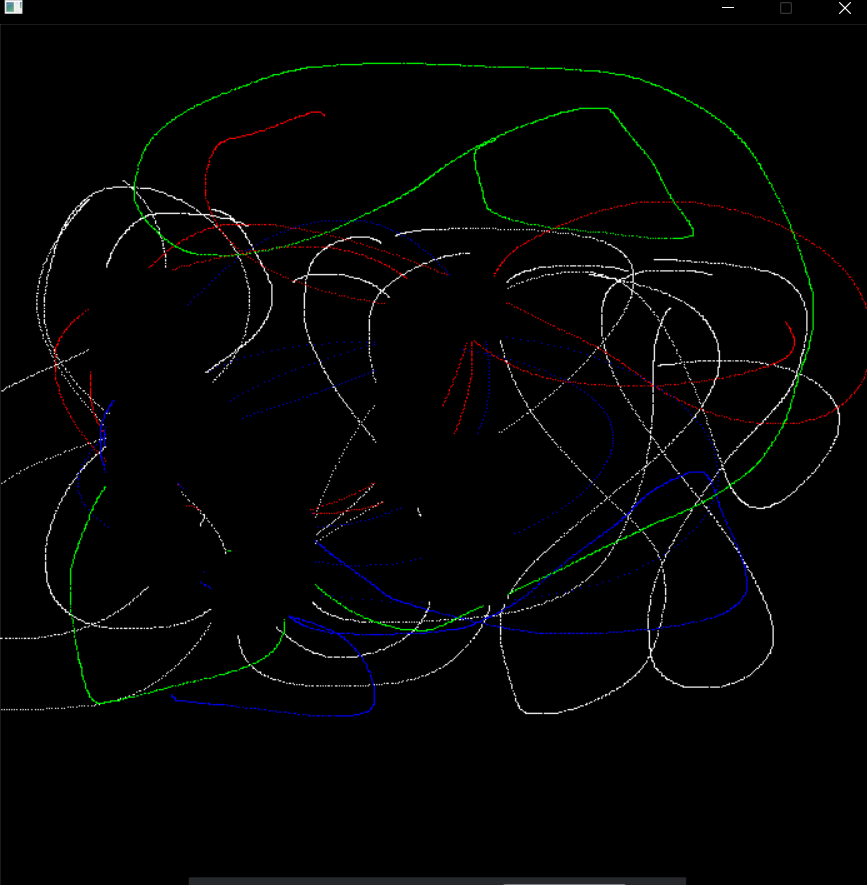

# Krafty Kraft

Basic paint application in C language done as a group project for computer in BEI 1st semester.

In order to try introducing graphics in C, we decided to make a paint app using C programming.For this, we used a library function called SDL(Simple Direct Media Layer).

It is a cross-platform development library designed to provide low level access to audio, keyboard, mouse, joystick, and graphics hardware via OpenGL and Direct3D.It can be used to make animations and video games.

It is written in C programming language and works with C++ and various other languages like c# and python.
